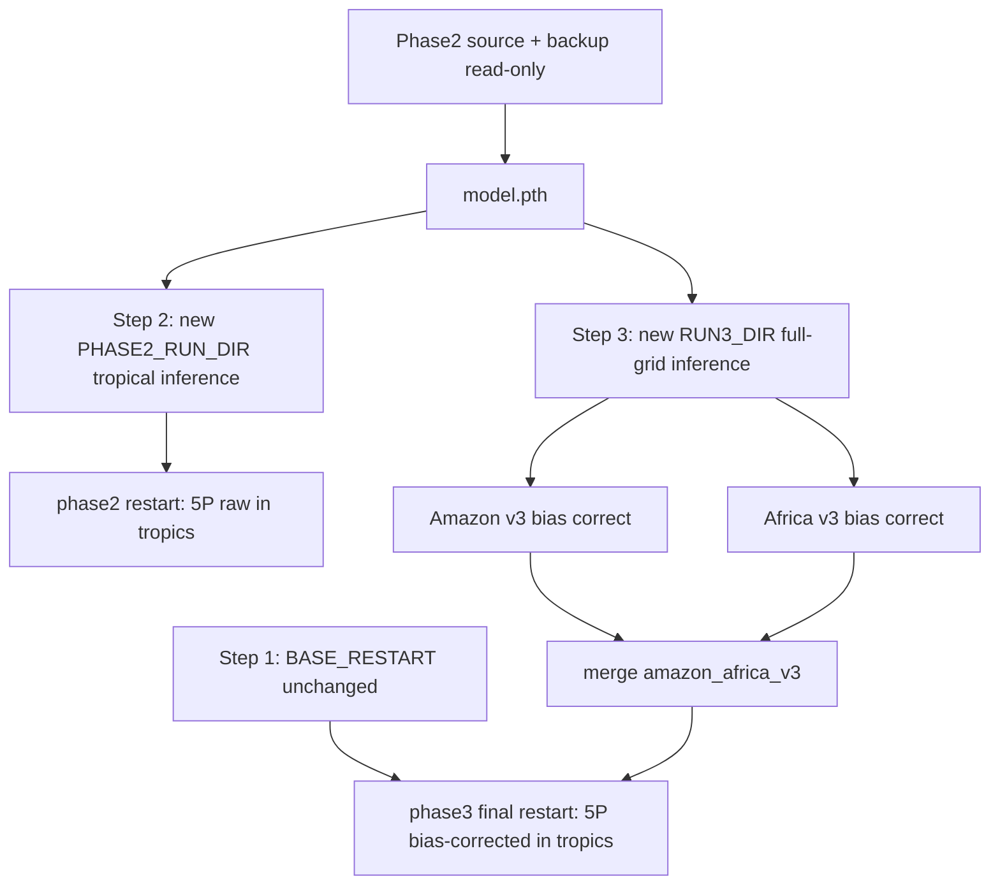

# Rerun Phase 2 (Tropical) and Phase 3 (Two-Region Bias Correction) Without CNP Ratio Fix

**Date:** 2026-06-17  
**Context:** Latest effort `cnp_results/run_20260512_083650_phase3_tworegions_(africa_improvement)` applied regional_fit_v3 Amazon + Africa bias correction on inference seeded from `run_20260315_210715_phase3_tworegions`. The original plan assumed CNP stoichiometric ratios would be fixed in tropical areas; that requirement has changed — tropical regions should **not** have N/P derived from C at inference time.

**Goal:** Rerun **Step 2** (tropical) and **Step 3** (two-region bias correction) while **keeping Step 1** (global model + base restart) unchanged.

**See also:**

- [WORKFLOW_PHASE1_PHASE2_PHASE3_RESTARTS.md](./WORKFLOW_PHASE1_PHASE2_PHASE3_RESTARTS.md) — full three-phase workflow
- [WORKFLOW_5P_TWO_REGIONS_BIAS_SCALE_AND_RESTARTS.md](./WORKFLOW_5P_TWO_REGIONS_BIAS_SCALE_AND_RESTARTS.md) — 5P bias/scale and restart details
- [CNP_RATIO_ENFORCEMENT_USAGE.md](./CNP_RATIO_ENFORCEMENT_USAGE.md) — what `--derive-np-from-c` / `--no-derive-np-from-c` do
- [5p_v3_amazon_africa_report.md](./5p_v3_amazon_africa_report.md) — v3 bias correction metrics baseline

---

## Scope summary

| Step | Keep (no rerun) | Rerun |
|------|-----------------|-------|
| **1 – Global** | `run_20260315_113900_phase1_global` → `updated_restart_base.nc` | Nothing |
| **2 – Tropical** | Phase2 checkpoint (read-only) + full backup | New run dir: tropical inference → NetCDF → phase2 restart |
| **3 – Bias correction** | Same Phase2 model + same `BASE_RESTART` | Full-grid inference → Amazon v3 + Africa v3 → merge → final restart |

The africa_improvement run **copied** inference from `run_20260315_210715_phase3_tworegions` and only reapplied v3 bias correction. For a true no-CNP-fix rerun, **regenerate inference from the Phase2 checkpoint** — do not copy old prediction CSVs.

---

## CNP ratio enforcement: what changes

`scripts/run_inference_all.py` runs model inference, then optionally calls `scripts/derive_np_from_c.py` to overwrite N/P predictions from C using stoichiometric ratios.

| Variable class | Affected by `--derive-np-from-c`? | Written to Phase2/3 restart? |
|----------------|-----------------------------------|------------------------------|
| Five soil P pools (`labilep_vr`, `occlp_vr`, `solutionp_vr`, `secondp_vr`, `primp_vr`) | No (direct model outputs) | **Yes** — only these are updated in tropics |
| PFT N/P (e.g. `leafn`, `frootp`) | Yes | No (extratropics unchanged; tropics keep Phase1 values) |
| Soil N/P derived from C (e.g. `soil1n_vr` from `soil1c_vr`) | Yes | No |

Phase2/Phase3 restarts update **only the five P variables** in the tropical band. Disabling derivation is still required so inference artifacts and any downstream NetCDF comparisons reflect raw model CNP, and so future steps are not accidentally run on derived N/P files.

**CLI (as of this report):** use `--no-derive-np-from-c` on all inference commands below. Default remains `--derive-np-from-c` (enabled) for backward compatibility.

---

## Prerequisites

### Step 0 — Back up Phase2 run (no overwrite)

A **full copy** of the original Phase2 directory is required before any rerun. The original and backup are **read-only**; all new Step 2 outputs go to a **separate** timestamped directory.

**Backup already created (2026-06-17):**

| Role | Path |
|------|------|
| Original (do not modify) | `cnp_results/run_20260315_175250_phase2_tropical` |
| Full backup (~3.3 GB) | `cnp_results/run_20260315_175250_phase2_tropical_backup_20260617` |

To recreate the backup on another machine or date:

```bash
cd /mnt/proj-shared/AI4BGC_7xw/AI4BGC

SRC="cnp_results/run_20260315_175250_phase2_tropical"
BACKUP="cnp_results/run_20260315_175250_phase2_tropical_backup_$(date +%Y%m%d)"

rsync -a "$SRC/" "$BACKUP/"
echo "Backup complete: $BACKUP" | tee "$BACKUP/README_BACKUP.txt"
```

Verify backup matches source (optional):

```bash
diff <(cd "$SRC" && find . -type f | sort) <(cd "$BACKUP" && find . -type f | sort)
du -sh "$SRC" "$BACKUP"
```

### Environment variables

Use **three** Phase2-related paths:

- `PHASE2_SOURCE_DIR` — original run (read-only; model + `cnp_config.json`)
- `PHASE2_BACKUP_DIR` — frozen copy (read-only; disaster recovery)
- `PHASE2_RUN_DIR` — **new** directory for Step 2 rerun outputs only

```bash
cd /mnt/proj-shared/AI4BGC_7xw/AI4BGC

export BASE_RESTART="cnp_results/run_20260315_113900_phase1_global/updated_restart_base.nc"
export PHASE2_SOURCE_DIR="cnp_results/run_20260315_175250_phase2_tropical"
export PHASE2_BACKUP_DIR="cnp_results/run_20260315_175250_phase2_tropical_backup_20260617"
export VARIABLE_LIST="CNP_IO_updated9_dev_dw.txt"
export TS=$(date +%Y%m%d_%H%M%S)
export PHASE2_RUN_DIR="cnp_results/run_${TS}_phase2_tropical_no_cnp_fix"
export RUN3_DIR="cnp_results/run_${TS}_phase3_tworegions_no_cnp_fix"

# Model weights (read from source; never write there)
export PHASE2_MODEL="$PHASE2_SOURCE_DIR/cnp_predictions/model.pth"
```

Confirm paths before starting:

```bash
test -f "$PHASE2_MODEL" && echo "Phase2 model OK"
test -f "$BASE_RESTART" && echo "Base restart OK"
test -d "$PHASE2_BACKUP_DIR" && echo "Phase2 backup OK"
mkdir -p "$PHASE2_RUN_DIR" "$RUN3_DIR"
```

### What not to do

1. **Do not retrain** the global model (Step 1).
2. **Do not retrain** Phase2 unless a new tropical model is intentionally desired.
3. **Do not write** into `PHASE2_SOURCE_DIR` or `PHASE2_BACKUP_DIR` — inference, NetCDF, and restarts go only to `PHASE2_RUN_DIR` and `RUN3_DIR`.
4. **Do not copy** `cnp_inference_entire_dataset` from `run_20260315_210715_phase3_tworegions` or `run_20260512_083650_phase3_tworegions_(africa_improvement)`.
5. **Do not reuse** existing `soil_2d_predictions_5P_bias_corrected_*_v3` directories — bias correction must run on fresh raw predictions.

---

## Step 2 — Tropical region (no retraining, no overwrite)

**Goal:** Raw Phase2 5P in the tropical band \([-30°, 30°]\) on top of the unchanged global base restart.

All outputs are written to **`$PHASE2_RUN_DIR`** (a new timestamped directory). The original `run_20260315_175250_phase2_tropical` and its backup are not modified.

### 2.1 Create rerun directory

```bash
mkdir -p "$PHASE2_RUN_DIR"
echo "phase2_tropical no_cnp_fix rerun from $PHASE2_SOURCE_DIR on $(date)" \
  > "$PHASE2_RUN_DIR/README_phase2_tropical_no_cnp_fix.txt"
```

### 2.2 Tropical-only inference (no CNP derivation)

Do **not** pass `--inference-full-grid` (tropical scope only).

**Completed run (2026-06-17):** `cnp_results/run_20260617_124923_phase2_tropical_no_cnp_fix/cnp_inference_tropical_only`

```bash
python scripts/run_inference_all.py \
  --model "$PHASE2_MODEL" \
  --output-dir "$PHASE2_RUN_DIR/cnp_inference_tropical_only" \
  --variable-list "$VARIABLE_LIST" \
  --no-derive-np-from-c
```

Comparison vs backup (`run_20260315_175250_phase2_tropical_backup_20260617/cnp_inference_tropical_only`): predictions are **identical** on all 5,374 tropical cells — see `cnp_results/run_20260617_124923_phase3_tworegions_no_cnp_fix/analysis/tropical_cnp_fix_vs_no_cnp_fix/COMPARISON_REPORT.md`.

### 2.3 Build tropical NetCDF

```bash
mkdir -p "$PHASE2_RUN_DIR/comparison_results"

python scripts/ai_predictions_to_netcdf.py \
  --ai-predictions "$PHASE2_RUN_DIR/cnp_inference_tropical_only/cnp_predictions" \
  --output "$PHASE2_RUN_DIR/comparison_results/ai_predictions_tropical_only_no_cnp_fix.nc" \
  --variable-list "$VARIABLE_LIST"
```

### 2.4 Create Phase2 tropical restart (5P only)

```bash
python scripts/ai_predictions_to_restart.py \
  --ai-predictions "$PHASE2_RUN_DIR/comparison_results/ai_predictions_tropical_only_no_cnp_fix.nc" \
  --restart-file "$BASE_RESTART" \
  --output "$PHASE2_RUN_DIR/updated_restart_phase2_tropical_5P_raw_no_cnp_fix.nc" \
  --variable-list "$VARIABLE_LIST" \
  --variables-to-update labilep_vr,occlp_vr,solutionp_vr,secondp_vr,primp_vr \
  "--tropical-lat-range=-30,30"
```

### 2.5 Checkpoint (optional)

Compare site profiles vs the previous phase2 restart:

```bash
python scripts/generate_site_5p_restart_comparison.py \
  --lon 28.0 --lat 0.0 --site-name africa_28_0

python scripts/generate_site_5p_restart_comparison.py \
  --lon 303.75 --lat -17.434553 --site-name amazon_303_17S
```

(Update script paths or env vars if it should point at the new restart files.)

---

## Step 3 — Two-region bias correction (regional_fit_v3)

**Goal:** Amazon + Africa bias-corrected 5P merged into a new global restart, matching the v3 workflow used in africa_improvement (`--regional-fit-v3`).

### 3.1 Create fresh Phase3 run directory

```bash
mkdir -p "$RUN3_DIR"
```

### 3.2 Full-grid inference (no CNP derivation)

Longest step (~several hours on GPU).

```bash
python scripts/run_inference_all.py \
  --model "$PHASE2_MODEL" \
  --output-dir "$RUN3_DIR/cnp_inference_entire_dataset" \
  --variable-list "$VARIABLE_LIST" \
  --inference-full-grid \
  --no-derive-np-from-c
```

### 3.3 Amazon-only bias correction (v3)

```bash
python scripts/apply_5p_bias_scale_correction.py \
  --run-dir "$RUN3_DIR" \
  --region-config-json config/training_config_amazon_5p_box.json \
  --output-subdir soil_2d_predictions_5P_bias_corrected_amazon_v3 \
  --regional-fit-v3
```

### 3.4 Africa-only bias correction (v3)

```bash
python scripts/apply_5p_bias_scale_correction.py \
  --run-dir "$RUN3_DIR" \
  --region-config-json config/training_config_africa_5p_box.json \
  --output-subdir soil_2d_predictions_5P_bias_corrected_africa_v3 \
  --regional-fit-v3
```

### 3.5 Merge Amazon + Africa

```bash
python scripts/merge_5p_bias_corrected_amazon_africa.py \
  --run-dir "$RUN3_DIR" \
  --amazon-subdir soil_2d_predictions_5P_bias_corrected_amazon_v3 \
  --africa-subdir soil_2d_predictions_5P_bias_corrected_africa_v3 \
  --output-subdir soil_2d_predictions_5P_bias_corrected_amazon_africa_v3 \
  --output-filename-suffix _bias_corrected_amazon_africa_v3
```

### 3.6 Build NetCDF and final restart

```bash
mkdir -p "$RUN3_DIR/comparison_results"

python scripts/ai_predictions_to_netcdf.py \
  --ai-predictions "$RUN3_DIR/cnp_inference_entire_dataset/cnp_predictions/" \
  --soil-2d-bias-corrected-subdir soil_2d_predictions_5P_bias_corrected_amazon_africa_v3 \
  --variable-list "$VARIABLE_LIST" \
  --output "$RUN3_DIR/comparison_results/ai_predictions_5P_bias_corrected_amazon_africa_v3_no_cnp_fix.nc"

python scripts/ai_predictions_to_restart.py \
  --ai-predictions "$RUN3_DIR/comparison_results/ai_predictions_5P_bias_corrected_amazon_africa_v3_no_cnp_fix.nc" \
  --restart-file "$BASE_RESTART" \
  --output "$RUN3_DIR/updated_restart_phase3_tworegions_5P_bias_corrected_amazon_africa_v3_tropical_no_cnp_fix.nc" \
  --variable-list "$VARIABLE_LIST" \
  --variables-to-update labilep_vr,occlp_vr,solutionp_vr,secondp_vr,primp_vr \
  "--tropical-lat-range=-30,30"
```

### 3.7 README for the new run

```bash
echo "phase3_tworegions no_cnp_fix: Phase2 5P + regional_fit_v3 Amazon/Africa bias correction; inference without --derive-np-from-c on $(date)" \
  > "$RUN3_DIR/README_phase3_tworegions_no_cnp_fix.txt"
```

---

## Validation (before ELM runs)

| Check | Command / artifact |
|-------|-------------------|
| Amazon/Africa 5P pred vs GT | `scripts/compare_5p_gt_two_regions_inference.py` on `$RUN3_DIR` |
| Site vertical profiles | `scripts/generate_site_5p_restart_comparison.py` (Africa 28°E, Amazon 303.75°W) |
| Compare to africa_improvement | Side-by-side metrics in `analysis/` and site comparison PNGs |
| Bias parameters audit | `$RUN3_DIR/analysis/bias_scale_params_5P_regional_fit_v3_*.json` |
| CNP ratios (if needed) | `scripts/validate_cnp_ratios.py --results-dir "$RUN3_DIR"` |

Compare against:

- Previous restart: `cnp_results/run_20260512_083650_phase3_tworegions_(africa_improvement)/updated_restart_phase3_tworegions_5P_bias_corrected_amazon_africa_v3_tropical.nc`
- v3 metrics baseline: `cnp_results/run_20260315_210715_phase3_tworegions/analysis/5p_pred_eval_baseline_v2_v3_summary.csv`

---

## Dependency flow



---

## Estimated effort

| Task | Approximate time |
|------|------------------|
| Step 2: tropical inference + restart | 1–2 hours |
| Step 3: full-grid inference | Several hours (GPU) |
| Step 3: bias correct + merge + restart | 30–60 minutes |
| Validation plots and metrics | ~30 minutes |

---

## Reference paths (current workspace)

| Role | Path |
|------|------|
| Base restart (Step 1) | `cnp_results/run_20260315_113900_phase1_global/updated_restart_base.nc` |
| Phase2 original (read-only) | `cnp_results/run_20260315_175250_phase2_tropical` |
| Phase2 backup (read-only) | `cnp_results/run_20260315_175250_phase2_tropical_backup_20260617` |
| Phase2 model weights | `.../cnp_predictions/model.pth` (under source or backup) |
| Step 2 rerun outputs | `cnp_results/run_<TS>_phase2_tropical_no_cnp_fix` |
| Step 3 rerun outputs | `cnp_results/run_<TS>_phase3_tworegions_no_cnp_fix` |
| Previous Phase3 (seed source) | `cnp_results/run_20260315_210715_phase3_tworegions` |
| Previous africa_improvement | `cnp_results/run_20260512_083650_phase3_tworegions_(africa_improvement)` |
| Amazon region config | `config/training_config_amazon_5p_box.json` |
| Africa region config | `config/training_config_africa_5p_box.json` |
| Variable list | `CNP_IO_updated9_dev_dw.txt` |

---

## Related code changes

- `scripts/run_inference_all.py`: `--derive-np-from-c` / `--no-derive-np-from-c` via `argparse.BooleanOptionalAction` (default: enabled).
